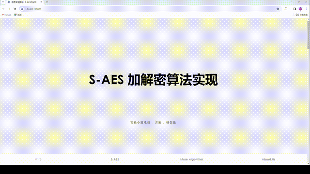
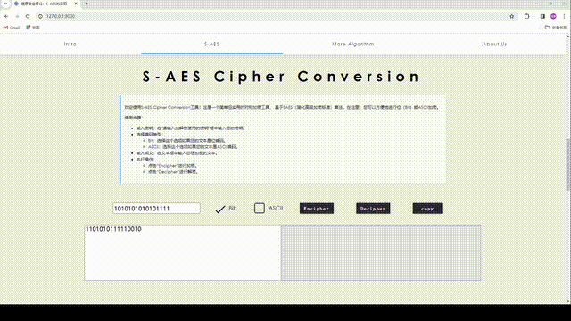
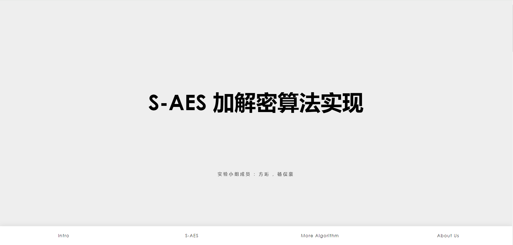
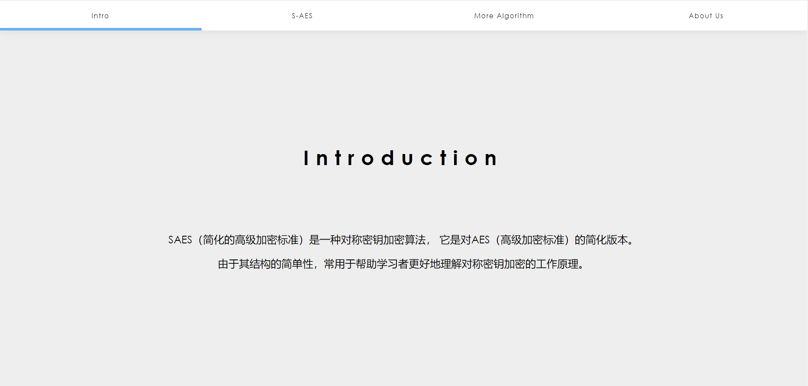
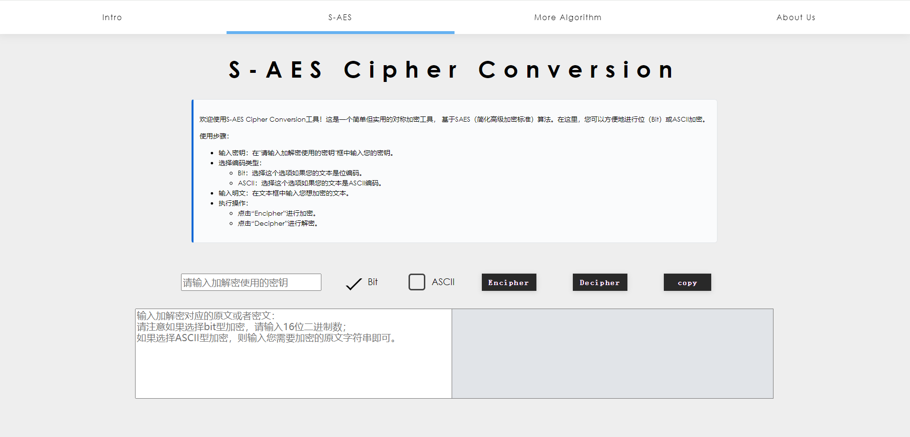
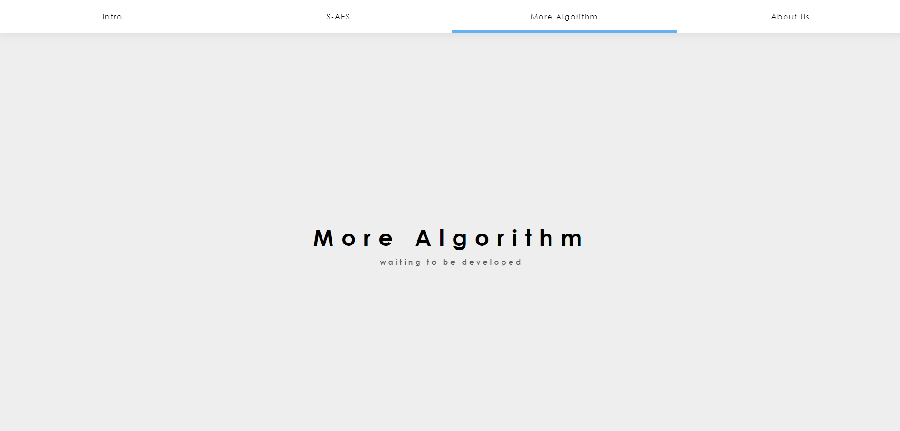
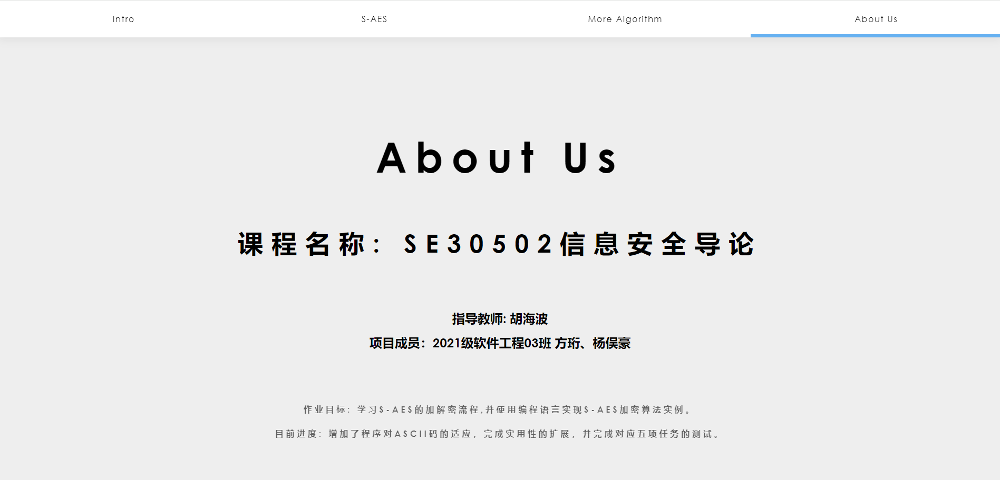
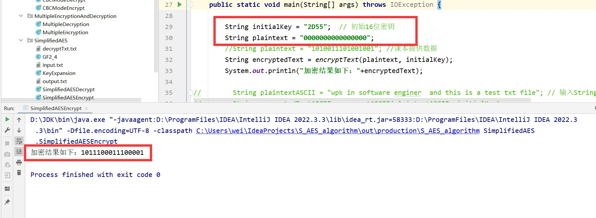

# CQU_SimpleAES_Toolkit
重庆大学大数据与软件学院信息安全导论作业2：S-AES算法实现

### 1. 算法实现

> 我们的S-AES算法实现在`SAES/SAES.py`文件中，其中可以使用到S-AES算法的加密和解密两个函数。 

为了实现良好的代码封装，我们定义了一个SAES的加密类。

- 初始化函数为：`def __init__(self, key,
                 S_BOX=None,
                 S_BOX_INV=None,
                 RCON=None,
                 MixMatrix=None,
                 MixMatrix_INV=None
                 ):`
  - 其中`key`为16整数倍长度的加密密钥key（后续会讨论整数倍key的多重加密处理）
  - `S_BOX`为S盒，`S_BOX_INV`为S盒的逆，`RCON`为轮常数，`MixMatrix`为Mix矩阵，`MixMatrix_INV`为Mix矩阵的逆。
  - 我们设计中将教材中的S盒、轮常数、Mix矩阵等参数设做默认值，方便用户使用，所以在实验中我们可以不传入这部分参数。
- 定义了：`def key_expansion(self):`函数，用于密钥扩展。
- 定义了：`def round_key_addition(text, key):`函数，用于轮密钥加。
- 定义了：`def sub_byte(self, text, use_inverse=False):`函数，用于S盒转换。
- 定义了：`def row_shift(text):`函数，用于行移位。
- 定义了：`def gf_add(a, b):`函数，用于GF(2^4)域内的加法
- 定义了：`def gf_mul(a, b):`函数，用于GF(2^4)域内的乘法
- 定义了：`def mix_column(column, matrix=None):`函数，用于列混淆。
- 定义了：`def mix_columns(input_string, matrix=None):`函数，用于列混淆块。
- 定义了：`def _single_encrypt(self, plaintext):`函数，单轮加密函数，输入明文，输出密文。加密key为16位。
- 定义了：`def _single_decrypt(self, ciphertext):`函数，单轮解密函数，输入密文，输出明文。解密key为16位。
- 定义了：`def encrypt(self, plaintext):`函数，多轮加密函数，输入明文，输出密文。加密key为16整数倍位。
- 定义了：`def decrypt(self, ciphertext):`函数，多轮解密函数，输入密文，输出明文。解密key为16整数倍位。

故在使用中我们可以直接实例化SAES类，生成一个加密对象。

对于这个加密类调用`encrypt`和`decrypt`函数就可以进行加密和解密操作（包括单轮加密以及多轮加密）。

### 2. GUI设计
> - 我们为了设计一个交互良好的界面，使用了`Django`框架进行GUI设计，设计了一系列的Web网页来实现作业需要的效果。
> - 我们的GUI设计中，主要分为五个页面，分别是`首页（index)`、`介绍（Intro）`、`S-AES`、`更多加密算法`、`关于我们`。

#### 2.1 Overview



上述的视频简单展示了我们的界面设计，可以看到我们的界面设计十分简洁，同时也有良好的交互性。

值得一提的是在加解密部分我们为了方便用户的使用，增加了一键复制的功能，可以帮助用户方便的复制加密后的密文或是解密后的明文。

### 3. 项目下载和Django配置

#### 3.1 项目下载
本项目是一个基于 Django 开发的网页应用，提供 SAES 加密功能。

```shell
git clone https://github.com/FangHeng/CQU_SimpleAES_Toolkit.git
cd CQU_SimpleAES_Toolkit
```

#### 3.2 安装Django

```shell
pip install django
```

#### 3.3 运行项目

```shell
python manage.py runserver
```

#### 3.4 IDE中设配置Configuration

- 在 PyCharm 中，选择 `Run` -> `Edit Configurations`。
- 点击 `+`，选择 `Django Server`。
- 在 `Host` 中填写 `127.0.0.1`。
- 在 `Port` 中填写 `8000`。
- 设置 `Environment variables` 为 `PYTHONUNBUFFERED=1;DJANGO_SETTINGS_MODULE=CQU_SimpleAES.settings`。
- 点击 `OK`。

### 4. 编程和测试要求

#### 4.1 第1关：基本测试

> 根据S-AES算法编写和调试程序，提供GUI解密支持用户交互。输入可以是8bit的数据和10bit的密钥，输出是8bit的密文。
> - 具体详细测试代码请看[task1测试文件夹](https://github.com/FangHeng/CQU_SimpleAES_Toolkit/tree/main/testZone/task1)。

##### 4.1.1 GUI界面中测试

输入可以是8bit的数据和10bit的密钥，输出是8bit的密文：


当输出不符合标准时，返回处理失败的错误：



##### 4.1.2 测试代码中测试

我们在`/testZone/task1`文件夹中提供了jupyter notebook的测试代码，可以直接打开task1测试文件夹中的[task1.ipynb文件](https://github.com/FangHeng/CQU_SimpleAES_Toolkit/tree/main/testZone/task1/task1.ipynb)，即可看到测试结果。

##### 4.1.3 GUI设计

###### 4.1.3.1 Index界面

index界面是程序的首页，包含标题和小组成员信息：



###### 4.1.3.2Intro界面

Intro界面是第二页，也是导航栏中的第一个元素，其简要介绍了课程所需实现的算法：



###### 4.1.3.3 S-AES界面

S-AES界面是本程序的核心界面，负责为用户提供了可供交互的前端GUI。在界面的上半部分提供使用说明，而界面的下半部分接受用户的输入，点击Encipher或者Decipher即完成加解密操作，并可以使用copy一键复制转换结果。



###### 4.1.3.4 More Algorithm界面

More Algorithm界面处于待开发状态，计划将来在此处可以实现其他加密算法的处理和转换逻辑。



###### 4.1.3.5 About Us界面

About Us界面主要介绍课程和项目的相关信息，包含课程名称代码、指导老师和目标进度等等。最后的脚注部分有github项目地址链接和copyright信息。



#### 4.2 第2关：交叉测试

> 考虑到是"算法标准"，所有人在编写程序的时候需要使用相同算法流程和转换单元(替换盒、列混淆矩阵等)，以保证算法和程序在异构的系统或平台上都可以正常运行。设有A和B两组位同学(选择相同的密钥K)；则A、B组同学编写的程序对明文P进行加密得到相同的密文C；或者B组同学接收到A组程序加密的密文C，使用B组程序进行解密可得到与A相同的P。
> - 具体详细测试代码请看[task2测试文件夹](https://github.com/FangHeng/CQU_SimpleAES_Toolkit/tree/main/testZone/task2)。

我们在该轮测试中与两个小组进行了交叉测试，验证了我们加密算法的正确性。

这里给出小组交叉测试的一个实例

**别组：**


**我们：**


我们在`/testZone/task2`文件夹中提供了与两个小组测试的jupyter notebook测试代码，可以直接打开task2测试文件夹中的[task2.ipynb文件](https://github.com/FangHeng/CQU_SimpleAES_Toolkit/tree/main/testZone/task2/task2.ipynb)，即可看到测试结果。

#### 4.3 第3关：扩展功能

> 考虑到向实用性扩展，加密算法的数据输入可以是ASII编码字符串(分组为1 Byte)，对应地输出也可以是ACII字符串(很可能是乱码)。
> - 具体详细测试代码请看[task3测试文件夹](https://github.com/FangHeng/CQU_SimpleAES_Toolkit/tree/main/testZone/task3)。

##### 4.3.1 GUI界面中测试

处理ASCII输入：


当输入不符合标准时，返回处理失败的错误：


##### 4.3.2 测试代码中测试

我们在`/testZone/task3`文件夹中提供了jupyter notebook的测试代码，可以直接打开task3测试文件夹中的[task3.ipynb文件](https://github.com/FangHeng/CQU_SimpleAES_Toolkit/tree/main/testZone/task3/task3.ipynb)，即可看到测试结果。

##### 4.3.3 ASCII码加密时的处理

因为我们常用的字符集仅仅只是0-127位的ASCII码，所以我们在加密时对应的只剩下了7位bit，这并不符合SAES算法的加密要求，我们综合考虑多种方式之后选择了更为全面的Unicode字符集，选取前256作为我们的字符集。

同时ASCII字符在加密后往往会出现乱码或者无法显示的控制符（但是不影响解密，只要正确复制后即可正常解密）。
所以我们在加密ASCII码是采用了显示十六进制的加密结果，而不是对应的Unicode字符，避免了很多无法显示的结果与乱码。
在对应的解密阶段我们也采用了十六进制的解密方式，将十六进制的密文转换为对应的ASCII码，这样就可以避免乱码的出现。

#### 4.4 第4关：多重加密

> 在实验的这一部分，我们探讨了多重加密的概念，并通过多次迭代的方法，使用不同的密钥对数据进行加密，从而提高加密的安全性。
> - 具体详细测试代码请看[task4测试文件夹](https://github.com/FangHeng/CQU_SimpleAES_Toolkit/tree/main/testZone/task4)。

##### 4.4.1 双重加密
我们扩展了S-AES算法，实现了双重加密。尽管分组长度仍为16 bits，但我们通过两次加密的方式将理论密钥空间扩展到了32 bits的密钥长度，其中包含两个16 bits的子密钥。

在我们建立加密类SAES的过程中,已经实现了多重加密的功能，定义在类方法中

```python
# 将key分割为16位长的元素
self.keys_list = [key[i:i + 16] for i in range(0, len(key), 16)]
```
在encrypt函数中的多重加密循环如下
```python
# 对每一个密钥进行加密操作
    for key in self.keys_list:
        self.key = key
        ciphertext = self._single_encrypt(ciphertext)
```
所以双重加密只需输入32bits拼接key即可，即
```python
# 拼接的32bits key
double_key = '10110011100110101101111011001101'
double_saes = SAES(key=double_key)
double_encrypted_ciphertext = double_saes.encrypt('替换明文')
```
- 具体详细实现请查看[task4测试文件夹](https://github.com/FangHeng/CQU_SimpleAES_Toolkit/tree/main/testZone/task4)


##### 4.4.2 中间相遇攻击
> 对双重加密而言，中间相遇攻击是相当致命的

模拟中间相遇攻击我们需要遍历所有可能的密钥，然后用每一个可能的密钥进行解密操作，检查解密后的结果是否是预期的明文即可。

值得一提的是当我们只拥有一个明密文对时,可能有上万个密钥满足情况。而当我们掌握了2~3个明密文对的时候就完全能够锁定密钥（当明密文对的结构太过于相似时会出现两对明密文无法解密出正确的key）。

就结果来看，我们可以通过jupyter中代码框的运行时间来看到，我们的中间相遇攻击算法的运行时间基本在秒级，大多在5s就可以完成破解，并给出全部的可能的key。

我们在`/testZone/task4`文件夹中提供了单组明密文对和多组明密文对的中间相遇攻击模拟数据，可以直接打开task4测试文件夹中的[task4.ipynb文件](https://github.com/FangHeng/CQU_SimpleAES_Toolkit/tree/main/testZone/task4/task4.ipynb)，即可看到模拟结果。

##### 4.4.3 三重加密
> (1)按照32 bits密钥Key(K1+K2)的模式进行三重加密解密,
> 
> (2)使用48bits(K1+K2+K3)的模式进行三重加解密
> 
> 考虑到我们在设计加密类时就已经考虑到了多重加密的情况,为了保持代码的连贯性我们选择第二种的模式

加解密的调用方法如下
```python
triple_key= '101100111001101011011110110011011011101000100111'
triple_saes = SAES(key=triple_key)
triple_encrypted_ciphertext = triple_saes.encrypt('替换明文')
triple_decrypted_plaintext = triple_saes.decrypt(triple_encrypted_ciphertext)
```
经过我们的加解密测试，多重加密的实现确认完成。完整的测试和实现请查看[task4测试文件夹](https://github.com/FangHeng/CQU_SimpleAES_Toolkit/tree/main/testZone/task4)
#### 4.5 第5关：工作模式

基于S-AES算法，我们使用密码分组链(CBC)模式对较长的明文消息进行加密。特别注意到初始向量(16 bits)的生成是必要的，并需要在加解密双方之间共享。

在CBC模式下，加密明文后尝试对密文分组进行替换或修改。解密后，比较篡改密文前后的结果，以观察篡改的影响。

##### 4.5.1 CBC工作模式的实现

在这一小节，我们选定了以下测试用例：

- 明文： "Hello S-AES and CBC!"
- 密钥： "1101001110100101"
- 初始向量 (IV)： "0101101000001111"

##### 4.5.2 采用CBC模式的加密过程

`cbc_encrypt` 函数接收用户的字符输入 `plaintext`，约定的 `key`，以及 `iv` 初始向量。

加密后得到的密文为：{ciphertext}

##### 4.5.3 对CBC模式的解密过程

`cbc_decrypt` 函数接收16进制字符串，约定的 `key` 以及 `iv` 初始向量。

解密后得到的明文为：{decrypted_text}

#### 4.5.4 篡改密文组结果分析

在加密过程中对密文块block1末位进行字节篡改,得到结果:

`(kllo S-AES and CBC!`

篡改效果符合预期: CBC密码分组链效果并不明显，仅在更改的块中有影响。

得出结论：在没有其他安全措施的情况下，加密过程中的篡改作用域为自身,CBC将会直接篡改而不引发其他影响。要保证密文快生成的连续性或类似汉明码的检查机制。

在加密完成后对密文分组进行篡改，得到被篡改的解密结果:

`(klmo S-AES and CBC!`

发现密文在形成后的篡改会引起后一个块的更改。得出结论：在没有其他安全措施的情况下，这种篡改会引起后一个block的解密失效。

这为判断篡改与否带来便利: 在重要的信息后增加一个确认block。者能够在一定程度上增加CBC工作模式的安全性。

#### 4.5.4 针对CBC的攻击

尽管这种加密模式很好地隐藏了明文的统计特性，但是同样也暴露出了一个很严重的缺点: 可以通过CBC的加密特点改变明文内容，但是这种改变并不会引起其它明文块对应位的改变。这种攻击常用来绕过过滤器，提权（比如从guest变为admin）等。

1. 字节反转攻击

在CBC模式下，每一个密文块的解密结果会与上一个密文块进行XOR操作，这使得我们可以通过修改前一个密文块来控制当前明文块的解密结果，而不会影响其他块的解密。

在猜测出明文分组Pn的情况下，那么可以通过修改密文分组

```markdown
Ci-1 = Ci-1 XOR Pn XOR A，
```

这样篡改解密Pn将得到A。详细的数学分析和形式化推理请前往[task5.ipynb文件](https://github.com/FangHeng/CQU_SimpleAES_Toolkit/tree/main/testZone/task5/task5.ipynb)查看

#### 4.5.5 结果分析

经过5.2的实例和5.3的分析，我们得出以下结论：

- 没有其他安全措施的CBC工作模式容易受到篡改攻击和字节替换攻击。
- 对于5.2的内容，我们进一步做了形式化的数学论证，证明了CBC模式下的密文块替换对解密过程的影响。

详细的证明和讨论我们放在了`/testZone/task5`文件夹中的[task5.ipynb文件](https://github.com/FangHeng/CQU_SimpleAES_Toolkit/tree/main/testZone/task5/task5.ipynb)，即可以看到详细的形式化论证过程和数学推导。

这样的实验过程也加深了我们对于该加密算法的理解和认识。

---
**至此，我们完成了全部S-AES加密算法的实现、GUI界面的设计，以及要求中提到的五个任务。较好的完成了本次实验。**